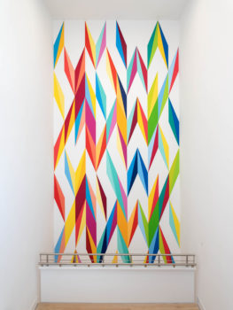
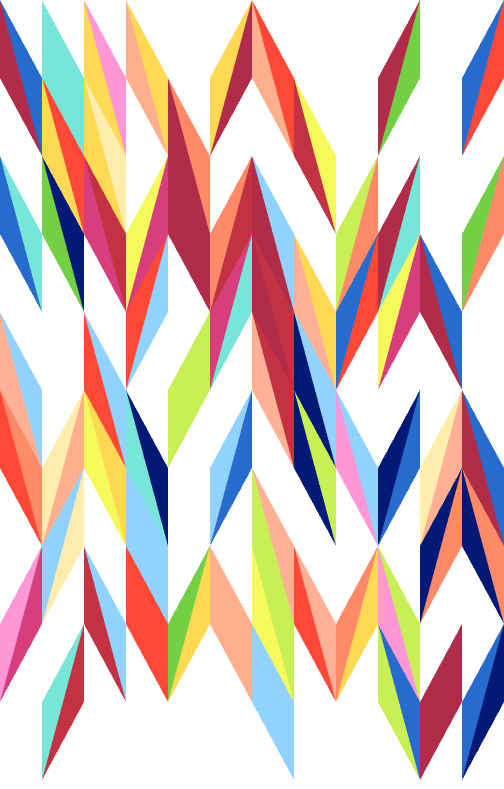
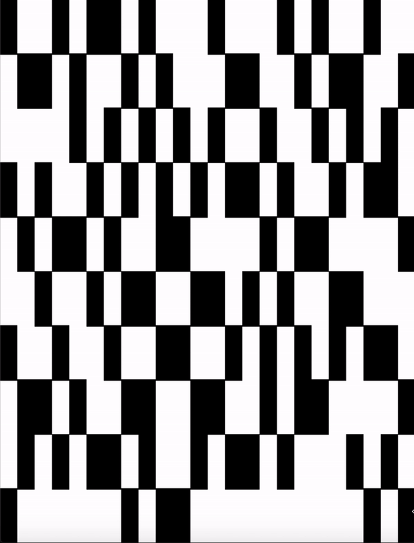
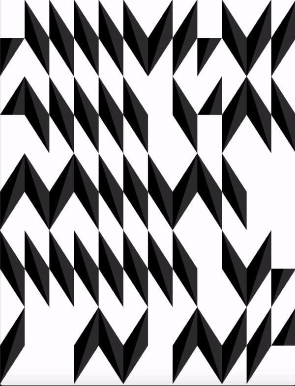
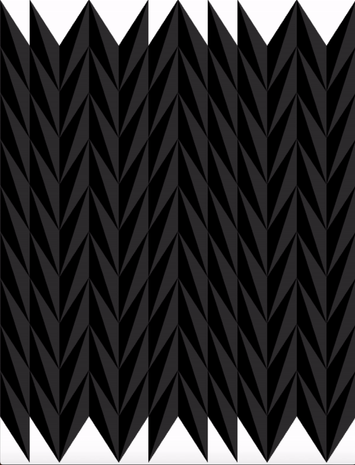
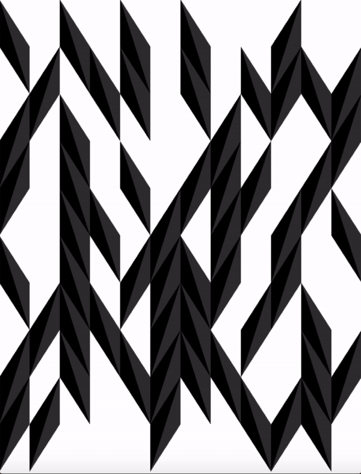

# ReOdita

## MIT Media Lab - Recreating the Past - Class 4: Odili Donald Odita

The MIT Media Lab class - Recreating the Past - explores a number of influential artists who have, over the past century, added their own unique perspective on computational art. Each week focuses on a new artist and through exploring their view point and recreating their artworks I hope to gain a valuable window into their thought processes, helping me learn how to express my own opinions through computational art. 

## Odili Donald Odita

In the forth week of Recreating the Past the focus is on patterns. Three main artists were covered in detail: Anni Albers (a master of textiles and weaving), Bridget Riley (a fine artist leveraging intricate patterning and optical illusions) and finally Odili Donald Odita with his powerful viewpoints on Color and it's effects on humanity and society.

I chose to spend this week diving into Odili Donald Odita's works as their bright and contrasting textures created detailed and complex spaces to be explored. Here is an excerpt from Odili's website, in his own words: (https://www.odilidonaldodita.com/statements/index.html)

“Color in itself has the possibility of mirroring the complexity of the world as much as it has the potential for being distinct.”

The organization and patterning in the paintings are of my own design. I continue to explore in the paintings a metaphoric ability to address the human condition through pattern, structure and design, as well as for its possibility to trigger memory. The colors I use are personal: they reflect the collection of visions from my travels locally and globally. This is also one of the hardest aspects of my work as I try to derive the colors intuitively, hand-mixing and coordinating them along the way. In my process, I cannot make a color twice – it can only appear to be the same. This aspect is important to me as it highlights the specificity of differences that exist in the world of people and things.

## Mamba Negra

Mamba Negra was a temporary Mural exhibit at the ICA in Miama, it consists of an interwoven set of trapezoids, each with a split color down the diagonal. The pattern appears random at first but it is in fact strongly regimented in a grid system.

Putting the original side by side with my recreation: 

Original            |  Recreation
:-------------------------:|:-------------------------:
 |   

#### Process

The way I approached this piece was to turn the canvas into a grid - 10 horizontal rows and 24 vertical lines. The original may appear at first to be 10 by 12 but its important to note that each diamond shape can be either diagonal to the left or to the right and hence splitting the 12 vertical columns into 24 allows for the specification of the diagonal direction.

The first rectangular representation below was to get a feel for this "grid" and whether it seems to reproduce the space of the original. Each of the grid cells has a probability of being blank or drawn as a rectangle.

This quickly led me to realize that within this grid there were a number of sub rules. For example if a "top" triangle is drawn in an even numbered cell, the "bottom" triangle will be diagonally below on the right. If it is drawn in an odd numbered cell then the opposite will be true. The second gif below represents what happends when drawing these triangles incorrectly - they do not align into the proper diamond shapes.

A number of extra rules later (such as specifying that certain matrix cells are available only for a top or a bottom triangle) which aided the tessalation I managed to build a consistent and randomly generated grid of trapezoids which reproduced the shape of the original piece.

   

Once I had the shape my focus moved onto reproducing the color in a way which was faithful to the original (as color is a very important theme in Odili's work). I quickly found that the matrix grid based approach I had implemented for drawing the trapezoids as two triangles also meant that I would need an equivalent grid/matrix approach for the colors. Without this there is no consistency between the randomly selected color for the top and bottom triangle (as can be seen from the middle gif below).

Implementing this matrix however solved this issue and enabled me to randomly sample colors in a consistent way between the shapes and finish the recreation (bottom right). I did however wish to expand on my exploration of the colors - at the moment the palette is hard coded from Odili's original but this didn't feel very satisfying know how much thought must have gone into the process of generating and selecting the colors.

I attempted to implement a color generation methodology using an inverse Kumaraswamy distribution (similar to a Beta distribution) so colors can be naturally sampled from a probabilistic distribution rather than being deterministic. I unfortunately didn't get time to finish this project however but hopefully it will be reappearing as a future work.

  